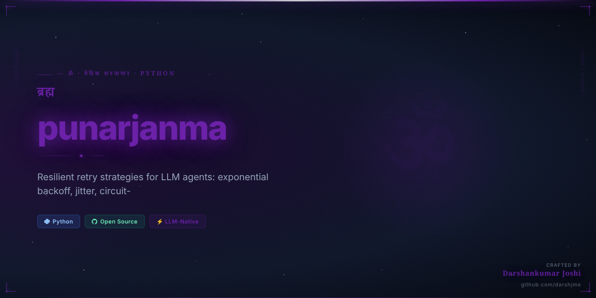
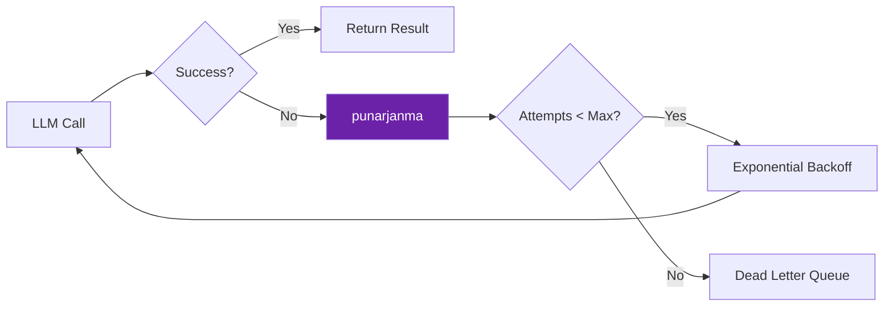

<div align="center">



# 🔮 पुनर्जन्म
## `punarjanma`

> *Upanishads / Bhagavad Gita 2.20*

### Rebirth — the eternal cycle

**Resilient retry strategies for LLM agents: exponential backoff, jitter, circuit-breaker patterns. Zero dependencies.**

[](https://python.org)
[](https://github.com/darshjme/punarjanma)
[](https://github.com/darshjme/arsenal)
[](LICENSE)

*Formerly `agent-retry` — Part of the [**Vedic Arsenal**](https://github.com/darshjme/arsenal): 100 production-grade Python libraries for LLM agents, each named from the Vedas, Puranas, and Mahakavyas.*

</div>

---

## The Vedic Principle

In the Bhagavad Gita, Lord Krishna reveals to Arjuna: *"na jāyate mriyate vā kadācin"* — the soul is never born, never dies. It returns, again and again, until liberation.

`punarjanma` brings this eternal principle to LLM agent engineering. When your API call fails, when the model returns garbage, when the network drops — the agent **returns**. Exponential backoff is not failure. It is the dharmic cycle of persistence, each attempt purified by the lessons of the last.

Just as the soul accumulates wisdom across lifetimes to finally achieve moksha, your agent accumulates context across retries to finally achieve its goal. The dead letter queue is not defeat — it is the end of a cycle, the completion of karma.

---

## How It Works



---

## Installation

```bash
pip install punarjanma
```

Or from source:
```bash
git clone https://github.com/darshjme/punarjanma.git
cd punarjanma && pip install -e .
```

## Quick Start

```python
from punarjanma import *

# See examples/ for full usage
```

---

## The Vedic Arsenal

`punarjanma` is one of 100 libraries in **[darshjme/arsenal](https://github.com/darshjme/arsenal)** — each named from sacred Indian literature:

| Sanskrit Name | Source | Technical Function |
|---|---|---|
| `punarjanma` | Upanishads / Bhagavad Gita 2.20 | Rebirth — the eternal cycle |

Each library solves one problem. Zero external dependencies. Pure Python 3.8+.

---

## Contributing

1. Fork the repo
2. Create feature branch (`git checkout -b fix/your-fix`)  
3. Add tests — zero dependencies only
4. Open a PR

---

<div align="center">

**🔮 Built by [Darshankumar Joshi](https://github.com/darshjme)** · [@thedarshanjoshi](https://twitter.com/thedarshanjoshi)

*"कर्मण्येवाधिकारस्ते मा फलेषु कदाचन"*
*Your right is to action alone, never to its fruits. — Bhagavad Gita 2.47*

[Vedic Arsenal](https://github.com/darshjme/arsenal) · [GitHub](https://github.com/darshjme) · [Twitter](https://twitter.com/thedarshanjoshi)

</div>
